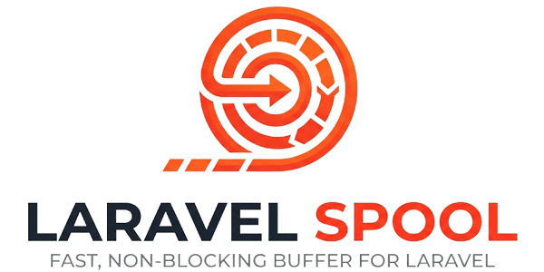

 

    
  

  

    
    
    
  

  

    Fast, non-blocking buffer for Laravel. Writes to Redis Streams or
  sharded filesystem
    files with automatic fallback, rotation, and batch flushing.
  

  

    <em>Currently under active development — available within a few
  days.</em>
  
